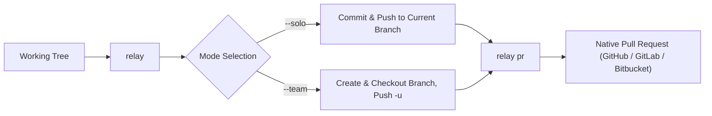

# Relay

<p align="left">
  <a href="https://github.com/Fiqqar/Relay/releases"></a>
  <a href="https://github.com/Fiqqar/Relay/actions/workflows/ci.yml"></a>
  <a href="https://github.com/Fiqqar/Relay/security/code-scanning"></a>
  <a href="https://www.python.org/"></a>
  <a href="https://github.com/astral-sh/ruff"></a>
  <a href="LICENSE"></a>
</p>

**Your Git workflow, on autopilot.**

Relay is a zero-dependency CLI that turns your daily Git loop into a single command: stage changed files, generate a Conventional Commit message via LLM, commit, push, and open a Pull Request.

```text
git add .  ──▶  Generate Conventional Commit  ──▶  git commit  ──▶  git push  ──▶  Open PR
```

<p align="center">
  
</p>



> [!NOTE]
> **Zero Network Dependency for Core Operations**  
> Relay runs entirely on the Python standard library. If the AI model is offline, rate-limited, or misconfigured, Relay immediately drops into an interactive manual prompt in the same terminal session so your work is never blocked.

---

## Key Capabilities

- **Zero Runtime Dependencies**  
  Built strictly with the Python standard library. No `requests`, no `pydantic`, no external CLI frameworks. Installs in seconds and runs anywhere Python 3.10+ is present.

- **AI-Powered Conventional Commits**  
  Inspects the actual `git diff --cached` and generates standard `type(scope): subject` commit messages. Supports Gemini, local Ollama, OpenAI, Anthropic, Mistral, Groq, and xAI.

- **Human-in-the-Loop Control**  
  Every message is presented for review before committing (`[Accept] [Edit] [Retry] [Abort]`). Auto-accept can be enabled with `--yes`.

- **Solo and Team Modes**  
  Use `--solo` to commit and push straight to your current branch. Use `--team <feature>` to auto-create feature branches, with built-in default branch protection preventing accidental direct pushes to `main`.

- **Native Forge Pull Requests**  
  Create PRs directly from your terminal (`relay pr`) via zero-dependency REST clients for GitHub, GitLab (including self-hosted), and Bitbucket Cloud.

- **Engineered for Reliability**  
  Subprocess calls are executed with strict `argv` arrays (`shell=False`). Secrets remain environment-only. Every command is tested with a 90%+ coverage gate.

---

## Installation

Requires **Python 3.10+** and `git` on your `PATH`.

| Platform | Package Manager | Command |
| :--- | :--- | :--- |
| **macOS / Linux** | Homebrew | `brew tap Fiqqar/relay && brew install Fiqqar/relay/relay` |
| **Windows** | Scoop | `scoop bucket add relay https://github.com/Fiqqar/Relay && scoop install relay/relay` |
| **Anywhere** | pip / git | `pip install "git+https://github.com/Fiqqar/Relay.git"` |

> [!TIP]
> You can also run the bundled installer directly from a cloned repo:
> ```bash
> python install.py --yes
> ```

---

## Quick Start

### 1. Set Provider Credentials

Set the API key for your chosen provider:

```bash
# Gemini (default)
export GEMINI_API_KEY="your-key-here"

# Or local Ollama (no key needed)
export RELAY_AI_PROVIDER="ollama"
```

### 2. Verify Your Environment

Run `relay doctor` to verify Python, Git, and credentials:

```console
$ relay doctor
[relay doctor] Relay 1.1.2 - gemini provider

  Python 3.10+       PASS   3.11.9
  relay on PATH      PASS   /usr/local/bin/relay
  git installed      PASS   2.43.0
  inside a git repo  PASS   branch: feat/auth, remote: yes, working tree: clean
  provider: gemini   PASS   Gemini API
  AI credentials     PASS   GEMINI_API_KEY is set
  GitHub token       PASS   GITHUB_TOKEN is set

  7 pass, 0 warn, 0 fail - system healthy.
```

### 3. Daily Workflow

```bash
# Solo workflow: stage all, generate commit message, push to current branch
relay --solo

# Team workflow: stage all, create feat/checkout branch, push upstream
relay --team "checkout"

# Open a pull request for the pushed branch
relay pr --open
```

---

## Command Reference

| Command / Flag | Description |
| :--- | :--- |
| `relay --solo` | Stage all, generate message, commit, and push to the current branch *(default)*. |
| `relay --team [NAME]` | Auto-create `<type>/<feature>` branch, commit, and push upstream. |
| `relay pr` | Open a PR on GitHub, GitLab, or Bitbucket (`-d` draft, `-o` open browser). |
| `relay undo` | Soft-reset the last commit (`HEAD~1`); modified files stay staged. |
| `relay amend` | Regenerate and replace the last commit message in place (never force-pushes). |
| `relay squash` | Fold the last N commits into a single clean Conventional Commit. |
| `relay stage` | Interactive file and hunk staging helper (`git add -p`). |
| `relay doctor` | Diagnose environment readiness (PATH, Git, tokens, remotes). |
| `relay completions [SHELL]` | Print a shell completion script (bash/zsh/fish/powershell). |
| `relay man` | Print the `relay(1)` manual page (roff) to stdout. |
| `relay telemetry [on\|off\|status]` | View or change opt-in anonymous usage telemetry (off by default). |
| `-m`, `--message TEXT` | Use this commit message instead of generating one with AI. |
| `--provider NAME` | AI provider override (`gemini`, `ollama`, `openai`, `anthropic`, `mistral`, `groq`, `xai`). |
| `--timeout SECONDS` | Seconds to wait for the AI response (default 30, max 120). |
| `--no-push` | Commit but do not push. |
| `--no-verify` | Skip git pre-commit and commit-msg hooks. |
| `--repo PATH` | Run on this repo path (repeatable; defaults to current dir). |
| `--yes` | Skip the confirmation menu and proceed automatically. |
| `--staged` | Only commit already-staged changes (skips `git add .`). |
| `--dry-run` | Preview diff, AI message, and execution plan without making changes. |
| `--allow-protected` | Explicit escape hatch to permit team mode on protected branches. |
| `--hunks` | Generate multi-part Conventional Commit message per file/hunk. |
| `--verbose` | Print exact Git and HTTP commands as they run. |

---

## AI Providers and Configuration

Relay reads settings from environment variables or an optional TOML config file (`~/.config/relay/config.toml` on POSIX, `%APPDATA%\relay\config.toml` on Windows).

| Provider | Identifier | Required Credential | Default Model | Base URL Override (Env) |
| :--- | :--- | :--- | :--- | :--- |
| **Gemini** | `gemini` | `GEMINI_API_KEY` | `gemini-2.5-flash` | — |
| **Ollama** | `ollama` | None | `qwen2.5-coder:7b` | `OLLAMA_BASE_URL` |
| **OpenAI** | `openai` | `OPENAI_API_KEY` | `gpt-4o-mini` | `OPENAI_BASE_URL` |
| **Anthropic** | `anthropic` | `ANTHROPIC_API_KEY` | `claude-3-5-haiku-latest` | `ANTHROPIC_BASE_URL` |
| **Mistral** | `mistral` | `MISTRAL_API_KEY` | `mistral-small-latest` | `MISTRAL_BASE_URL` |
| **Groq** | `groq` | `GROQ_API_KEY` | `llama-3.3-70b-versatile` | `GROQ_BASE_URL` |
| **xAI** | `xai` | `XAI_API_KEY` | `grok-beta` | `XAI_BASE_URL` |

### Sample Configuration (`config.toml`)

```toml
[relay]
provider = "gemini"
branch_template = "feat/<feature>"
pr_open = true

[team.protected]
branches = ["main", "master", "develop"]

[relay.ignore]
paths = ["dist/*", "*.lock", "package-lock.json"]
```

> [!IMPORTANT]
> **Secrets Are Environment-Only**  
> Tokens and API keys are never read from configuration files and are never written to disk or logs. This ensures repository configuration can be safely shared without credential leakage.

---

## Documentation

Full architectural specifications and governance documentation:

- [Product Specification (PRD)](docs/SPEC.md) — Personas, requirements, and functional scope.
- [System Architecture](docs/ARCHITECTURE.md) — Component interactions and data flow.
- [Logical Flow & State Machine](docs/FLOW.md) — Detailed execution paths and fallback matrix.
- [Architecture Decision Records (ADRs)](docs/ADR.md) — Permanent records of design choices.
- [Threat Model & Security](docs/THREAT_MODEL.md) — Security boundaries, SSRF guards, and mitigations.
- [Working Rules](docs/WORKING_RULES.md) — Engineering standards and CI gates.
- [Project Roadmap](docs/ROADMAP.md) — Milestones, shipped features, and release history.

---

## Contributing & License

Contributions are welcome. Please read [CONTRIBUTING.md](CONTRIBUTING.md) and [docs/WORKING_RULES.md](docs/WORKING_RULES.md) before submitting patches.

Distributed under the [MIT License](LICENSE).
